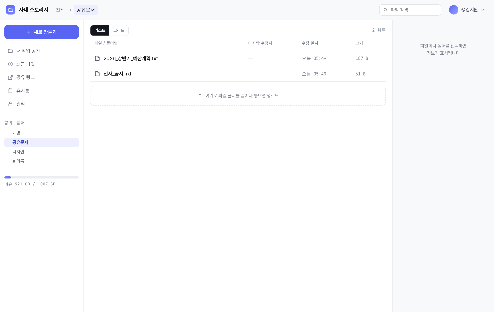
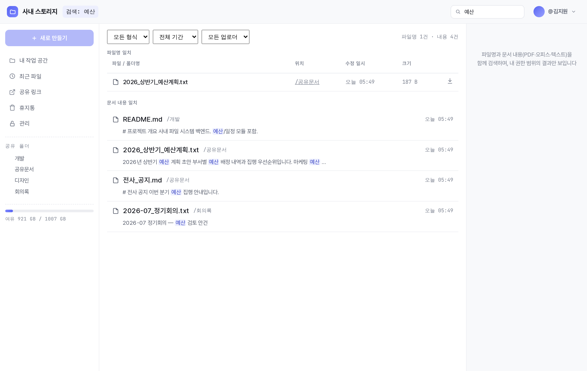
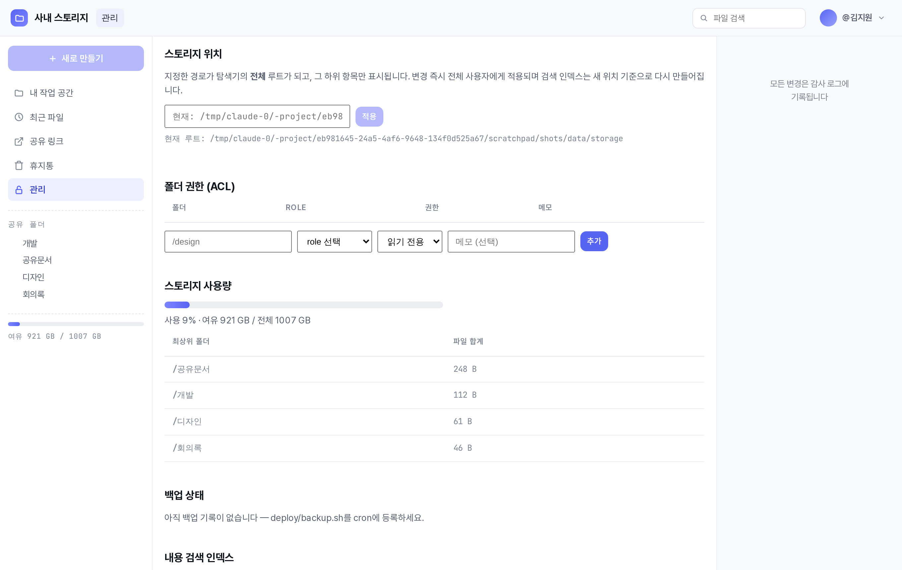
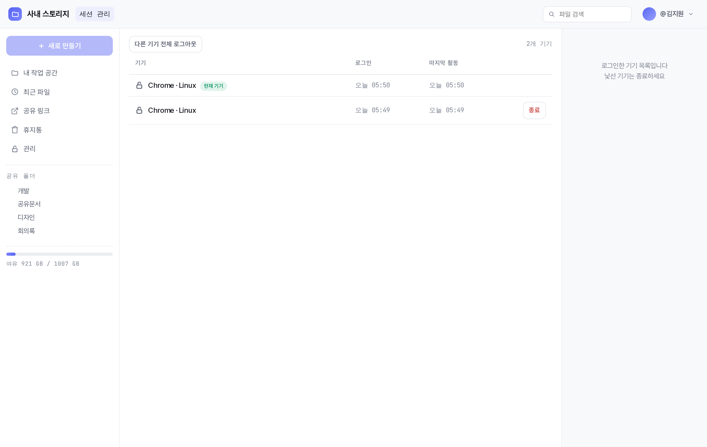
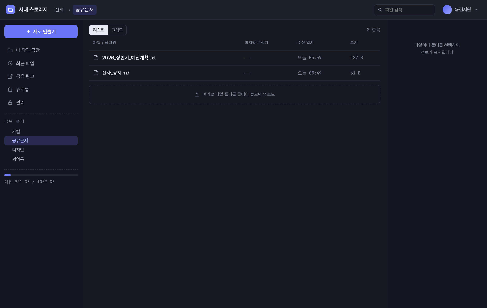

# 사내 파일 시스템 (Intranet File System)

10~20인 규모 조직의 사내 로컬 서버(NAS) 파일을 **웹에서 관리**하는 시스템.
Discord OAuth2 + Role 기반 권한, 3단 레이아웃 파일 탐색기, 문서 내용 검색,
공유/파일 요청 링크, 감사 로그까지 갖춘 자체 호스팅 파일 서버다.

- 배포 산출물은 **프로세스 1개** (SPA가 서버에 번들됨)
- 저장소는 **실제 파일시스템** — DB는 메타데이터·권한·인덱스만 보관(파일 실체는 디스크)
- UI 명세: `docs/file-system-ui-spec.html` · 기술 스펙: `docs/file-system-dev-spec.md` ·
  확장 스펙: `docs/file-system-extended-spec.md`

## 화면

> 아래 스크린샷은 `pnpm test:e2e`와 같은 방식으로 **실제 서버를 띄우고 시드 데이터를
> 넣은 뒤 헤드리스 브라우저로 촬영**한 실제 화면이다.

### 파일 탐색기 (3단 레이아웃)


### 검색 — 파일명 + 문서 내용(FTS) + 필터


### 관리 대시보드 (스토리지·ACL·사용량·백업·내용 인덱스)


### 세션 관리


### 다크 모드


---

## 목차

1. [핵심 기능](#핵심-기능)
2. [기술 스택](#기술-스택)
3. [아키텍처](#아키텍처)
4. [빠른 시작 (개발)](#빠른-시작-개발)
5. [명령](#명령)
6. [환경 변수](#환경-변수)
7. [권한 모델](#권한-모델)
8. [데이터 모델](#데이터-모델)
9. [API 레퍼런스](#api-레퍼런스)
10. [검색 아키텍처](#검색-아키텍처)
11. [보안](#보안)
12. [테스트](#테스트)
13. [배포](#배포)
14. [설계 노트 & 함정](#설계-노트--함정)
15. [기능 이력](#기능-이력)

---

## 핵심 기능

**탐색 & 파일 조작**
- 3단 레이아웃(사이드바 트리 · 리스트/그리드 · 정보 패널), breadcrumb 네비게이션
- 업로드(드래그&드롭 · 폴더째 업로드 · XHR 진행률 토스트 · `.tmp` 스테이징 후 원자적 rename)
- 폴더 생성 · 이름 변경 · 이동/복사(다중 선택 배치) · 휴지통 이동
- 다중 선택(Ctrl/Shift) + 일괄 이동/복사/삭제 + **zip 스트리밍 다운로드**(폴더 포함, 임시파일 없음)
- 키보드 단축키(Del/F2/Enter/Esc/방향키), 딥링크(우클릭 '링크 복사' → 해당 행 포커스·강조)

**미리보기 & 썸네일**
- 인라인 미리보기: 이미지 · PDF · 동영상 · 오디오 · 텍스트 (html/svg는 저장 XSS 방지로 inline 금지)
- 오피스/한글(docx·xlsx·pptx·hwpx) → 추출 텍스트 미리보기
- 그리드 썸네일: 이미지(sharp webp) + PDF 첫 페이지(unpdf 렌더 → webp)
- 미리보기 모달 좌우 이동(방향키/버튼, 같은 폴더 순회)

**검색**
- 파일명 부분 일치(NFC·소문자 LIKE) + **문서 내용 검색**(FTS5 trigram — PDF·오피스·hwpx·텍스트)
- 필터: 위치 스코프 · 형식(문서/이미지/영상/음성/압축) · 기간 · 업로더
- 최근 수정 파일(`/recent`)

**공유 & 협업**
- 공유 링크(무인증 다운로드, 만료 1/7/30일, 다운로드 카운트)
- **파일 요청 링크**(역방향 — 외부인이 로그인 없이 지정 폴더로 업로드, 내부 경로 비노출)
- 폴더 구독(구독 폴더 활동 시 Discord DM), 즐겨찾기(핀)
- 버전 보관(같은 이름 덮어쓰기 시 이전본 최근 5개 자동 보관 + 복원)

**권한 & 거버넌스**
- Discord OAuth2 로그인 + Role 기반 ACL(폴더 prefix 매칭)
- 개인 공간 격리(`/home/{userId}` 본인 write, 타인 접근 불가)
- admin role: 전 경로 접근(타인 home은 read), 관리 페이지
- 접근 요청 큐(못 보는 폴더 신청 → admin 승인/반려 → DM)
- 세션 관리(로그인 기기 목록 · 원격 종료)

**운영 & 관측**
- 활동 감사 로그(14종 액션 — 업로드·삭제·다운로드·권한변경·공유 등 전부 기록)
- 관리 대시보드(사용량 · 감사 로그 · ACL CRUD · 내용 인덱스 상태 · 백업 상태 · 접근 요청)
- Discord 웹훅 알림(공유 폴더 활동 · 디스크 여유 경고 · 주간 활동 다이제스트)
- 업로드 바이러스 스캔(ClamAV, 선택), SSE 실시간 목록 갱신, 다크 모드, 반응형

---

## 기술 스택

### 공통
- **언어**: TypeScript 5.7 (전 패키지)
- **패키지 매니저**: pnpm (워크스페이스 모노레포)
- **런타임**: Node.js 20 이상 (24까지 확인)

### 서버 (`server/`)
| 계층 | 기술 |
|---|---|
| 웹 프레임워크 | **Fastify 5** |
| DB | **SQLite** (`better-sqlite3` 12, 동기 API) + **Drizzle ORM** 0.39 |
| 실행 | `tsx` (트랜스파일 없이 TS 직접 실행) |
| 플러그인 | `@fastify/cookie`(서명 세션) · `@fastify/helmet`(CSP) · `@fastify/multipart`(업로드) · `@fastify/rate-limit` · `@fastify/static`(Range 다운로드) |
| 파일 감시 | `chokidar` 4 (외부 변경 → 인덱스 추종) |
| 이미지 | `sharp` (webp 썸네일) |
| PDF | `unpdf` (텍스트 추출 + 첫 페이지 렌더), `@napi-rs/canvas` (렌더 백엔드, 프리빌트) |
| 압축 | `archiver`(zip 스트리밍), `fflate`(오피스/hwpx zip 해제) |
| 테스트 | `vitest` (단위) + 자체 Node E2E 하네스 |

### 웹 (`web/`)
| 계층 | 기술 |
|---|---|
| 빌드 | **Vite 6** + `@vitejs/plugin-react` |
| UI | **React 19** |
| 라우팅 | `react-router-dom` 7 |
| 서버 상태 | `@tanstack/react-query` 5 |
| 스타일 | 순수 CSS(`web/src/styles.css`) — UI 명세 HTML의 디자인 토큰 1:1 이식, **Tailwind 미사용** |

### 네이티브 모듈
`better-sqlite3` · `sharp`는 빌드 필요 → 루트 `package.json`의 `pnpm.onlyBuiltDependencies`에
등록되어 있어 pnpm 10에서도 추가 조치 불필요. `@napi-rs/canvas`는 플랫폼별 프리빌트
바이너리라 빌드 없이 설치된다.

---

## 아키텍처

### 모노레포 구조
```
file-system/
├── shared/               서버·웹 공용 API 타입 (@fs/shared) — API 형태의 단일 출처
│   └── src/{api-types,constants,index}.ts
├── server/               Fastify + SQLite
│   ├── src/
│   │   ├── index.ts          앱 부팅·인증 훅·스케줄러(재스캔·휴지통 비우기·다이제스트)
│   │   ├── config.ts         env 로딩·검증, 작업 폴더 배치
│   │   ├── settings.ts       런타임 설정(스토리지 루트 변경)
│   │   ├── notify.ts         웹훅·DM·주간 다이제스트
│   │   ├── auth/             discord OAuth·봇 role 조회, 세션
│   │   ├── acl/              권한 해석(resolve)·규칙 저장(store)
│   │   ├── db/               drizzle 스키마·부팅 DDL·마이그레이션·시드
│   │   ├── fs/               경로보안·인덱서·추출·내용인덱스·스캔·버전·휴지통 등
│   │   ├── routes/           15개 라우트 모듈
│   │   └── watcher/          chokidar 워처
│   └── test/                 vitest 단위 + e2e/ 통합 하네스
├── web/                  Vite + React SPA
│   └── src/features/         access·admin·auth·explorer·info·meta·overlays·
│                             preview·sessions·share·shell·sidebar·trash
├── docker/               Dockerfile · docker-compose.yml · Caddyfile
├── deploy/               backup.sh
└── docs/                 UI·dev·extended 스펙
```

### 저장소 레이아웃 (`STORAGE_ROOT`)
```
STORAGE_ROOT/
├── <사용자 폴더/파일들>      ← 탐색 대상 (진실의 원천 = 라이브 readdir)
├── home/{discordUserId}/     ← 개인 공간 (본인 write 자동)
├── .tmp/                     ← 업로드 스테이징 (원자적 rename용)
├── .trash/{uuid}             ← 휴지통 실체
└── .versions/                ← 이전 버전 보관
```
`.` 으로 시작하는 항목은 탐색·검색에서 전부 제외되며 경로 보안 계층이 접근을 차단한다.
DB(`app.db`)·썸네일 캐시는 스토리지가 아니라 `DATABASE_PATH` 옆에 둔다.

### 요청 흐름
```
브라우저 → (dev: Vite :6001 프록시 / prod: Fastify가 SPA 직접 서빙)
        → Fastify :3000
        → onRequest 인증 훅(세션 쿠키 검증 + role 캐시 + last_seen)
        → 라우트 핸들러 → ACL 검사 → safe-path 변환 → 파일시스템/DB
```
목록·트리·다운로드의 **진실의 원천은 항상 라이브 파일시스템**이고, `fs_index`(검색·최근
파일용)와 `content_index`(내용 검색용)는 그 상태를 뒤따라가는 2차 인덱스다.

---

## 빠른 시작 (개발)

요구사항: **Node 20+** · **pnpm**(`corepack enable`).

```bash
pnpm install
pnpm seed:dev     # 샘플 폴더/파일 + ACL 시드 (dev 전용)
pnpm dev          # server(:3000) + web(:6001) 동시 실행
```

→ **http://localhost:6001** 접속. Discord 미설정 상태에서는 **dev auth 모드**로 동작해
`[Discord로 로그인]` 버튼이 가짜 유저(`DEV_USERNAME`, roles=`DEV_ROLES`)로 즉시 로그인한다.

관리자 화면(`/admin`)까지 보려면 레포 루트 `.env`에:
```
ADMIN_ROLE_ID=admin-role
DEV_ROLES=design,admin-role
```

실제 Discord 연동은 `.env.example`을 `.env`로 복사해 `DISCORD_*` 4개를 채운다.
Developer Portal에서 앱 생성 → OAuth2 redirect `{BASE_URL}/api/auth/callback` 등록 →
봇 생성 후 사내 서버에 초대(유저 토큰으로는 role 조회 불가 → **봇 토큰 필수**).

---

## 명령

| 명령 | 동작 |
|---|---|
| `pnpm dev` | 개발 서버 (server + web, `/api`·`/share*`는 Vite가 프록시) |
| `pnpm build` | web 빌드 → `server/public/` |
| `pnpm start` | 프로덕션 단일 서버 (:3000, SPA 포함) |
| `pnpm test` | 서버 단위 테스트 (vitest, 80개) |
| `pnpm test:e2e` | 통합 E2E — 실서버 기동 후 전 기능·정합성 검증 |
| `pnpm typecheck` | 전 패키지 타입 검사 |
| `pnpm seed:acl` | `server/src/db/acl-seed.ts`의 ACL 적용 |
| `pnpm seed:dev` | 샘플 스토리지 + ACL 시드 |

---

## 환경 변수

전부 선택이며 미설정 시 안전한 기본값으로 동작한다(dev auth). `server/src/config.ts` 참조.

### 기본
| 변수 | 기본 | 설명 |
|---|---|---|
| `PORT` | `3000` | 서버 포트 |
| `HOST` | `0.0.0.0` | 바인딩 주소(본인 PC 전용이면 `127.0.0.1`) |
| `BASE_URL` | `http://localhost:6001` | OAuth redirect·공유 링크 URL의 기준. **프로덕션은 실 도메인 필수** |
| `SESSION_SECRET` | (dev용 불안전값) | 쿠키 서명 키. **프로덕션 필수**(32B+ 랜덤) |
| `STORAGE_ROOT` | `./data/storage` | 실제 파일 저장 루트 |
| `DATABASE_PATH` | `./data/app.db` | SQLite 파일 |
| `MAX_UPLOAD_MB` | `2048` | 업로드 파일당 최대 크기 |

### 인덱스 & 작업 폴더
| 변수 | 기본 | 설명 |
|---|---|---|
| `WATCH_POLLING` | `false` | inotify 미지원 마운트(WSL 9p/drvfs, 일부 NFS/SMB)에서 `true` |
| `INDEX_RESCAN_MIN` | `10` | 주기 전체 재스캔(분). 워처가 놓친 변경의 안전망. `0`=끔 |
| `INDEX_DISABLED` | `false` | 초대형 트리를 루트로 잡을 때. 검색·최근파일만 꺼지고 탐색은 정상 |
| `TMP_DIR`/`TRASH_DIR`/`VERSIONS_DIR` | (STORAGE_ROOT 안) | 작업 폴더 위치 재정의. **STORAGE_ROOT와 같은 볼륨 필수**(rename 원자성) |
| `TRASH_RETENTION_DAYS` | `30` | 휴지통 자동 비우기 기한. `0`=끔 |

### 권한 & 알림
| 변수 | 기본 | 설명 |
|---|---|---|
| `ADMIN_ROLE_ID` | (없음) | 이 Discord role 보유자 = admin |
| `DISCORD_WEBHOOK_URL` | (없음) | 설정 시 공유 폴더 활동·디스크 경고·주간 다이제스트 전송 |
| `DIGEST_DAY` / `DIGEST_HOUR` | `1`(월) / `9` | 주간 다이제스트 요일(0=일~6=토)·시각. `DIGEST_DAY=-1`=끔 |

### Discord (미설정 시 dev auth)
`DISCORD_CLIENT_ID` · `DISCORD_CLIENT_SECRET` · `DISCORD_BOT_TOKEN` · `DISCORD_GUILD_ID`
그리고 dev auth 전용: `DEV_USER_ID` · `DEV_USERNAME` · `DEV_ROLES`

### 내용 검색 & 바이러스 스캔
| 변수 | 기본 | 설명 |
|---|---|---|
| `CONTENT_SEARCH_DISABLED` | `false` | 문서 내용 검색(추출·FTS) 끄기. 파일명 검색은 유지 |
| `CONTENT_MAX_MB` | `20` | 이 크기 초과 파일은 내용 추출 생략 |
| `CLAMAV_HOST` | (없음) | 설정 시 업로드를 clamd로 스캔 |
| `CLAMAV_PORT` / `CLAMAV_TIMEOUT_MS` | `3310` / `30000` | clamd 연결 |
| `SCAN_FAIL_CLOSED` | `true` | 무인증(파일요청) 업로드는 스캐너 장애 시 차단 |
| `BACKUP_STATUS_PATH` | (DB 옆) | `backup.sh`가 남기는 상태 파일 경로 |

---

## 권한 모델

- ACL은 `folder_acl` 테이블(관리 UI 또는 `server/src/db/acl-seed.ts` 코드 시드)로 관리
- **해석 규칙**: 경로에 매칭되는 규칙 중 **가장 깊은 path prefix가 승리**, 같은 깊이면
  `write > read`, 매칭 없으면 **숨김**(none)
- 규칙은 **역할(role) 기반** — 특정 유저가 아니라 Discord role에 권한을 준다
- `/home/{discordUserId}` = 본인 자동 write, 타인은 ACL로도 접근 불가
- admin role(`ADMIN_ROLE_ID`) = 전 경로 접근(타인 home은 read), 관리 API·페이지
- 모든 변경 라우트(upload·mkdir·rename·move·copy·trash·share·thumbnail·download)가
  **동일하게** 권한을 강제한다(E2E로 전수 검증됨)

---

## 데이터 모델

### Drizzle 테이블 (`server/src/db/schema.ts`)
| 테이블 | 용도 |
|---|---|
| `users` | Discord 유저(id·username·avatar·최근 로그인) |
| `sessions` | 서명 세션(role 캐시 · User-Agent · last_seen) |
| `file_meta` | 파일별 업로더·업로드 시각 |
| `activity_log` | 감사 로그(14종 액션 · actor · detail JSON) |
| `share_links` | 공유/파일요청 링크(token · kind · 만료 · 카운트) |
| `pinned_paths` | 즐겨찾기(유저별 경로) |
| `subscriptions` | 폴더 구독(유저별 경로) |
| `access_requests` | 접근 요청(경로 · 권한 · 상태 · 처리자) |
| `folder_acl` | ACL 규칙(path prefix · roleId · read/write) |
| `settings` | 런타임 설정(스토리지 루트 · 마지막 다이제스트 시각) |
| `trash` | 휴지통 원장(원경로 · 삭제자 · 크기) |

### 보조 인덱스 (파일시스템을 뒤따르는 2차 인덱스)
| 테이블 | 용도 |
|---|---|
| `fs_index` | 파일명 검색·최근 파일 (기동 fullScan + 워처 + 주기 재스캔으로 동기화) |
| `content_index` | 문서별 추출 상태(mtime·ok/skipped/error) |
| `content_fts` | FTS5 trigram 가상 테이블 — 문서 본문 부분 일치 |

### 마이그레이션
도구 없이 부팅 시 idempotent DDL(`CREATE TABLE IF NOT EXISTS`) + 컬럼 추가(`addColumnIfMissing`)
+ CHECK 제약 변경 시 테이블 재생성. 병렬 프로세스 경합에 안전(try/catch, `busy_timeout=5000`).

---

## API 레퍼런스

모든 `/api/*`는 인증 필요(단 `/api/auth/*`·`/api/health` 제외). `/share/:token`·
`/share-upload/*`는 **무인증 공개** 경로.

### 인증 · 세션 · 나
`GET /api/auth/login` · `GET /api/auth/callback` · `POST /api/auth/logout` ·
`GET /api/me` · `GET /api/health` ·
`GET /api/sessions` · `DELETE /api/sessions/:id` · `POST /api/sessions/revoke-others`

### 파일 조회 · 다운로드
`GET /api/fs/list` · `GET /api/fs/tree` · `GET /api/fs/download`(inline 옵션·Range) ·
`GET /api/fs/download-zip` · `GET /api/fs/thumbnail`(이미지·PDF) ·
`GET /api/fs/preview-text`(오피스/한글 추출)

### 파일 변경
`POST /api/fs/upload` · `POST /api/fs/mkdir` · `PATCH /api/fs/rename` ·
`POST /api/fs/move` · `POST /api/fs/copy` · `DELETE /api/fs/trash` ·
`GET /api/trash` · `POST /api/fs/restore`

### 버전
`GET /api/fs/versions` · `GET /api/fs/versions/download` · `POST /api/fs/versions/restore`

### 검색 · 메타
`GET /api/search`(q·from·ext·days·uploader) · `GET /api/recent` ·
`GET /api/activity`(파일 타임라인) · `GET /api/users`

### 공유 · 구독 · 핀 · 접근 요청
`POST/GET /api/share` · `DELETE /api/share/:token` · `GET /share-upload.js` ·
`GET/POST/DELETE /api/subscriptions` · `GET/POST/DELETE /api/pins` ·
`GET/POST /api/access-requests`

### 실시간 · 사용량
`GET /api/events`(SSE) · `GET /api/usage`

### 관리자 (admin 전용)
`GET/PUT /api/admin/settings` · `GET/POST /api/admin/acl` · `DELETE /api/admin/acl/:id` ·
`GET /api/admin/roles` · `GET /api/admin/usage` · `GET /api/admin/activity` ·
`GET /api/admin/content-index` · `POST /api/admin/content-index/retry` ·
`POST /api/admin/trash/purge` · `GET /api/admin/access-requests` ·
`POST /api/admin/access-requests/:id/resolve` · `GET /api/admin/backup-status`

### 공개 (무인증)
`GET /share/:token`(다운로드) · `GET/POST /share-upload/:token`(파일 요청 페이지·수신)

---

## 검색 아키텍처

**파일명 검색**은 `fs_index.name_search`(NFC·소문자) LIKE 스캔 — 10~20인 NAS 규모에선
FTS 동기화 복잡도가 이득보다 크다는 판단.

**문서 내용 검색**은 별도 2차 인덱스:
- 추출(`fs/extract.ts`): PDF(unpdf) · docx/xlsx/pptx/hwpx(fflate zip + XML strip) · 평문.
  레거시 바이너리(doc/hwp/xls/ppt)는 파서 유지비 대비 효용이 낮아 제외
- 인덱싱(`fs/content-index.ts`): `content_fts`(FTS5 **trigram** — 한글 포함 3글자 이상
  부분 일치, 2글자는 LIKE 폴백). 추출은 **백그라운드 큐**에서 한 건씩(업로드/스캔을 막지 않음),
  mtime 같으면 재추출 스킵
- `fs_index` 갱신 훅(upsert/remove/move/fullScan)을 그대로 추종 → 항상 정합
- 검색 결과는 파일명·내용 두 섹션으로 분리 표시, 둘 다 **권한 필터** 통과분만

---

## 보안

- **인증**: 서명(HMAC) 세션 쿠키(httpOnly·SameSite=Lax·prod secure). role 캐시 10분 TTL,
  Discord 장애 시 최대 1시간 stale 허용, 길드 탈퇴 시 즉시 차단
- **경로 보안**(`fs/safe-path.ts`): `..`·백슬래시·제어문자·dot 세그먼트 거부, 루트 탈출 이중 차단
- **CSP**(helmet): 기본 self, inline 스크립트 금지 → 파일 요청 페이지 JS도 `/share-upload.js` 별도 서빙
- **저장 XSS 방지**: html/svg는 어떤 경우에도 inline 렌더 금지(항상 attachment)
- **rate limit**: 전역 300/분, 로그인·공유 다운로드·파일요청은 라우트별 강화
- **바이러스 스캔**(선택): 업로드 스테이징을 clamd로 검사, 무인증 경로는 fail-closed
- **감사**: 모든 변경·다운로드가 `activity_log`에 기록(무인증 업로드는 actor=`share-link`)

---

## 테스트

### 단위 (`pnpm test`) — vitest, 80개
`acl` · `safe-path` · `names` · `watcher` · `purge` · `extract` · `content-search` ·
`search-filters` · `trash-size` · `scan` · `digest` · `sessions`.
DB 공유 때문에 파일 병렬 실행은 끔(`vitest.config.ts`, `fileParallelism: false`).

### 통합 E2E (`pnpm test:e2e`) — 102 checks
`server/test/e2e/`가 **실제 서버를 임시 데이터(OS temp)로 띄우고 실 HTTP로 전 기능을
통과**시킨다. 단위가 개별 함수를 본다면, E2E는 라우트·권한·인덱스·로그가 서로
어긋나지 않는지 **정합성**을 본다.

- **다중 신원**: 서명 세션을 DB에 직접 심어 admin·editor·guest 세 유저를 만들고,
  단일 유저로는 못 보는 권한 경계·사용자 간 격리를 실제로 확인
- **시나리오 A~K**: 핵심 FS · 권한 강제(전 변경 라우트) · 읽기전용·홈 격리 · 휴지통 ·
  버전 · 공유/파일요청 · 검색(FTS·필터·권한) · 구독 · 접근요청 · 세션 · 관리 · 경로 보안
- **정합성 불변식**: `fs_index` ↔ 디스크(누락·고아 0) · `content_index` ⊆ `fs_index` ·
  휴지통 원장 ↔ `.trash` 실체 · `.tmp` 잔여물 0 · `activity_log` 액션 기록 완전성
- 서버는 `node --import tsx`로 자체 기동(크로스플랫폼), 끝나면 프로세스·임시데이터 정리.
  네이티브 모듈이 빌드된 상태여야 하므로 `pnpm install` 후 실행

---

## 배포

`docker/` 에 프로덕션 세트가 있다.
```
docker/
├── Dockerfile          멀티스테이지(web 빌드 → server 번들)
├── docker-compose.yml  app + Caddy(자동 HTTPS) + ClamAV(선택)
└── Caddyfile           리버스 프록시 + TLS
```

**절차**
1. 레포 루트 `.env`에 프로덕션 값(`DISCORD_*` 4개 · `SESSION_SECRET` · `ADMIN_ROLE_ID` ·
   실 `BASE_URL` · 선택 `DISCORD_WEBHOOK_URL`·`CLAMAV_HOST`·`DIGEST_DAY`)
2. `acl-seed.ts`를 실제 Discord role ID로 수정
3. `docker-compose.yml`의 `STORAGE_HOST_PATH`(NAS 마운트 경로), `Caddyfile`의 도메인 수정
4. `docker compose up -d --build`

**백업** (`deploy/backup.sh`) — SQLite `.backup`(WAL 안전) + 스토리지 `rsync --link-dest`
증분. cron 예시 `0 4 * * *`. 성공/실패를 `backup-status.json`으로 남겨 관리 화면에 노출.
⚠ 최초 1회 복구 리허설 필수.

---

## 설계 노트 & 함정

> **같은 이름 업로드**는 " (1)" 회피가 아니라 **기존본을 버전으로 보관하고 이름을 승계**한다
> (파일↔폴더 충돌만 " (1)"). 이전 버전은 우클릭 → '버전 기록'. 단 **파일 요청 링크(무인증)
> 업로드는 항상 " (1)" 회피**(덮어쓰기·버전 없음).

> **inotify 미지원 마운트**(WSL 9p/drvfs 등)에서는 `WATCH_POLLING=true` 필요. 어느
> 환경이든 `INDEX_RESCAN_MIN` 주기 재스캔이 안전망.

> **작업 폴더**(`.tmp`/`.trash`/`.versions`)는 rename 원자성 때문에 반드시 STORAGE_ROOT와
> 같은 볼륨이어야 한다. 드라이브 루트처럼 dot 폴더를 못 만드는 환경은 `TMP_DIR` 등으로 재지정.

> **접근 요청 승인은 권한을 자동 부여하지 않는다** — ACL이 role 기반이라, 승인은 결정·알림
> 고리만 닫고 admin이 ACL 규칙을 수동 추가한다.

> **미구현으로 남긴 것**: 오피스 동시 편집(OnlyOffice/Collabora — 무거운 인프라, 수요 확인 후) ·
> WebDAV · 실시간 협업 커서. 레거시 바이너리 포맷 내용 추출도 제외.

---

## 기능 이력

### 기본 마일스톤 M1~M4
- **M1** 로그인/차단, ACL·경로보안, 트리·리스트·breadcrumb·다운로드
- **M2** 업로드(원자적)·폴더생성·이름변경·이동/복사·휴지통(+복원), activity_log, 업로더 표시
- **M3** 정보 패널 타임라인, 파일명 검색, 최근 파일, fs_index(스캔+워처+재스캔)
- **M4** 그리드 뷰+이미지 썸네일, 반응형, 읽기전용 자물쇠, 휴지통 자동 비우기

### 확장 R1~R4
- **R1** Docker/Caddy/백업, helmet+rate-limit, admin role
- **R2** 파일 미리보기, 다중선택+zip, 폴더째 업로드, 웹훅 알림, SSE
- **R3** 관리 페이지(ACL CRUD·사용량·감사 로그), 디스크 게이지·경고
- **R4** 공유 링크, 버전 보관, 다크 모드, 즐겨찾기, 단축키, **문서 내용 검색**(FTS5)

### 고도화 (스펙 외)
- **1차** 검색 필터 · 딥링크 · 다운로드 감사 로그 · 휴지통 관리 · 내용 인덱스 대시보드
- **2차** 파일 요청 링크(무인증 수신) · 폴더 구독 Discord DM
- **3차** 업로드 바이러스 스캔 · 오피스/한글 미리보기 · PDF 썸네일 · 미리보기 좌우 이동
- **4차** 접근 요청 · 세션 관리 · 주간 활동 다이제스트 · 백업 가시성
- **검증** 통합 E2E 하네스 편입(`pnpm test:e2e`)
